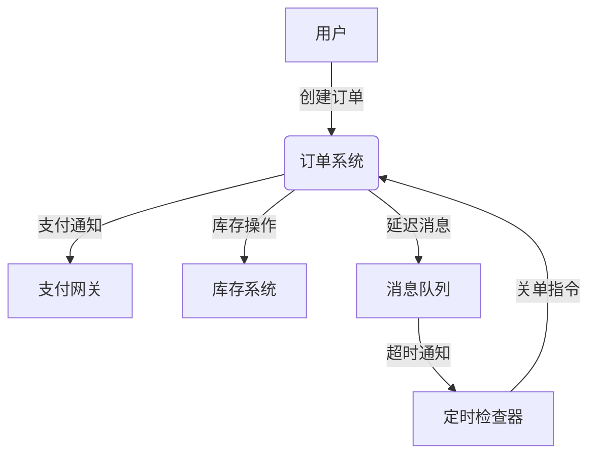
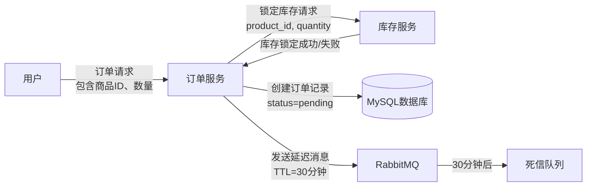
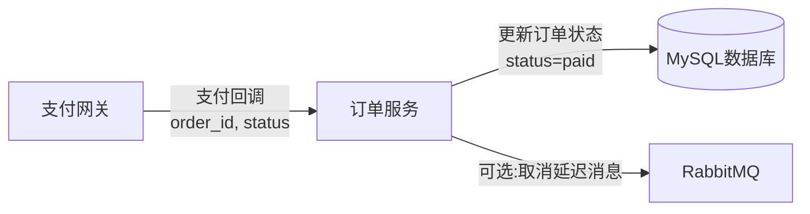
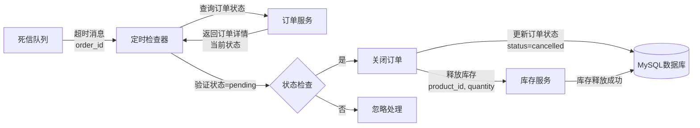

# 电商订单超时自动关单数据流图 (DFD)

## Level 0 - Context Diagram

## Level 1 - Detailed Data Flow

### 1. 订单创建流程

### 2. 支付成功流程

### 3. 超时关单流程

## 数据存储说明

### MySQL 数据库
- **orders 表**: 存储订单基本信息和状态
  - 字段: id, user_id, status, created_at, updated_at
  - 状态值: pending, paid, cancelled
  
- **inventory 表**: 存储商品库存信息
  - 字段: product_id, available_stock, locked_stock
  - available_stock: 可用库存
  - locked_stock: 已锁定库存（待支付订单占用）

### RabbitMQ 消息队列
- **普通队列**: 接收延迟消息，TTL=30分钟
- **死信队列**: 接收超时的延迟消息
- **消息格式**: JSON 包含 order_id, created_at 等信息

## 数据流关键点

1. **库存预扣**: 订单创建时立即锁定库存，保证超卖防护
2. **延迟消息**: 使用TTL机制实现精确的30分钟超时控制
3. **状态验证**: 超时处理前必须验证订单仍为pending状态
4. **幂等性**: 所有操作都支持重复执行而不产生副作用
5. **异常兜底**: 定期扫描长时间pending的订单作为消息丢失的补偿机制

## 外部系统交互

- **支付网关**: 异步回调通知支付结果
- **用户系统**: 验证用户身份和权限
- **商品系统**: 获取商品信息和价格（在订单创建阶段）